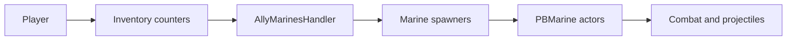

# PB Custom Marines

**PB Custom Marines** is a GZDoom / UZDoom add-on for [**Project Brutality**](https://github.com/pa1nki113r/Project_Brutality) that adds **friendly AI marine allies** to your squad. Marines use Project Brutality’s weapon systems, can spawn through tier-based progression, and **persist across maps** so your squad carries over between levels.

**Original Authors:** HyperExia (elite marine content builds on work by AresFallen).

---

## What you get

- **Combat allies** — Marines engage enemies with weapon-specific behavior (26 standard variants, one per weapon archetype, plus six optional elite variants).
- **Radio beacon** — Summon or recall marines using the marine beacon inventory item (`AllySummoner`).
- **Orders** — Tell the squad to **guard**, **mobilize**, or **teleport** to you (bound in `KEYCONF.txt`; see [Controls](#controls)).
- **Optional systems** — Reloads, glory-kill style executions, pickups (health/armor), giving ammo/weapons/health to the player, weapon drops on death, warping/teleport behavior, and more—most are configurable via CVARs and the in-game menu.

---

## How it works (overview)

The mod splits responsibilities the usual Doom-mod way:

- **ZScript** holds the core logic: the abstract `PBMarine` class (behavior, reloads, attacks, movement, death), mixins for names/spawns/tiers/damage, **projectile** bases with damage scaling and friendly-fire rules, spawners, drops, and the **`AllyMarinesHandler`** event handler registered in [`ZMAPINFO`](ZMAPINFO).
- **DECORATE** defines concrete marine actors (per-weapon sprites, properties, and weapon-specific state overrides).
- **Persistence** — Each marine type is tracked with **`NumberOfAllies*`** inventory on the player so counts survive map changes; the event handler can respawn marines when autospawn is enabled.
- **Spawning** — Weighted **tier-based spawners** tie marine variety to progression (e.g. `PB_GlobalStats` / levels completed). Map-start and scripted spawner variants exist for different setups.

For class hierarchy, file layout, and contributor-oriented detail, see [`AGENTS.md`](AGENTS.md).

---

## Requirements

| Requirement | Notes |
|-------------|--------|
| **Engine** | GZDoom or UZDoom (ZScript 4.10+). **UZDoom 4.14.x** is verified against this tree; older engines may differ in ZScript strictness. |
| **Project Brutality** | Load **before** this add-on. The mod expects PB types at runtime (e.g. `PB_WeaponBase`, `PB_GlobalStats`, `PBRandomSpawner`, `PB_SpawnerBase`). Track **[PB_Staging](https://github.com/pa1nki113r/Project_Brutality/tree/PB_Staging)** for API changes. |
| **Load order** | Project Brutality first, then this package (`.pk3`). |

### Compatibility (PB_Staging + UZDoom 4.14)

Recent maintenance restored load and play against **PB_Staging** and **UZDoom 4.14.3**, including:

- **PB API** — `PB_WeaponBase` no longer exposes `respectInventoryItem` on current PB; handoff logic uses PB respect / helmet guards instead of that property.
- **UZDoom ZScript** — Pathfinder actors cannot use `+FAST` inside ZScript `Default` blocks here; fast behavior is applied with `A_ChangeFlag` in `PostBeginPlay`. Reload helper `D_AbortAndReloadIfEmpty` uses a **single** method signature; states that only pass a weapon and a minimum ammo count use `D_AbortAndReloadIfEmpty("PB_…", null, amount)`.

Details for contributors (overload rules, call patterns, upstream notes) are in **[`AGENTS.md`](AGENTS.md)** under *UZDoom 4.14+ and PB_Staging compatibility*.

---

## Installation

There is no separate compile step. Package the mod folder as a **`.pk3`** (ZIP format with a `.pk3` extension), load it **after** Project Brutality in your launcher or command line. On Windows, `Compress-Archive` only emits `.zip`; rename the archive to `.pk3` if your tool does not write `.pk3` directly.

---

## Controls

Keys are defined in [`KEYCONF.txt`](KEYCONF.txt) under the **“Project Brutality Marines”** section. Defaults are set in the engine’s key binding UI; typical bindings include:

| Action | Mechanism |
|--------|-----------|
| **Activate Marine Beacon** | `use AllySummoner` |
| **Order allies to guard** | `use OrderToGuard` |
| **Order allies to mobilize** | `use OrderToMobilize` |
| **Order allies to teleport to player** | `use OrderToTeleport` |

Some alternate / experimental guard-follow commands remain commented out in `KEYCONF.txt`.

---

## Configuration

### In-game menu

Under **Project Brutality** options, open **“Addon - Marines Settings”** (see [`MENUDEF`](MENUDEF)). That opens **“Project Brutality Marine options”** (`PBMarinesSettings`), with a submenu **“Project Brutality Marine Behavior Options”** for behavior tuning.

### CVARs

Server CVARs are declared in [`CVARINFO`](CVARINFO). Highlights:

| CVAR | Role |
|------|------|
| `pb_autospawnmarines` | Surviving marines spawn at map start |
| `pb_marinesdropweapons` | Drop weapons vs ammo on death |
| `pb_marine_damage_factor` / `pb_marine_boss_damage_factor` | Damage dealt multipliers |
| `pb_marine_damage_taken` / `pb_marine_damage_taken_boss` | Damage taken multipliers |
| `pb_marinesreload` | Reload mechanics |
| `pb_marinesglorykill` | Glory kill executions |
| `pb_marinespickupitems` | Pick up health/armor |
| `pb_elitemarines` | Elite marine spawns |
| `pb_marineswarp` | Warp-related behavior |
| `debugLogCustomMarines` | Extra console logging for debugging |

Many more toggles and sliders (map-start spawns, pickup range, squad-size adaptation, quiet voices, etc.) appear in the menus and in `CVARINFO`.

---

## Credits

See [`CREDITS`](CREDITS). This project draws on **Sgt Mark IV**’s marines and **Project Brutality**’s earlier marine direction, with HyperExia’s own code and **Base Ally**–style foundations from ModDB.

---

## Further reading

- **[`AGENTS.md`](AGENTS.md)** — Technical architecture, persistence, projectiles, friendly-fire layers, and how to extend the mod.
- **[Project Brutality (PB_Staging)](https://github.com/pa1nki113r/Project_Brutality/tree/PB_Staging)** — Upstream mod for API and class compatibility.
